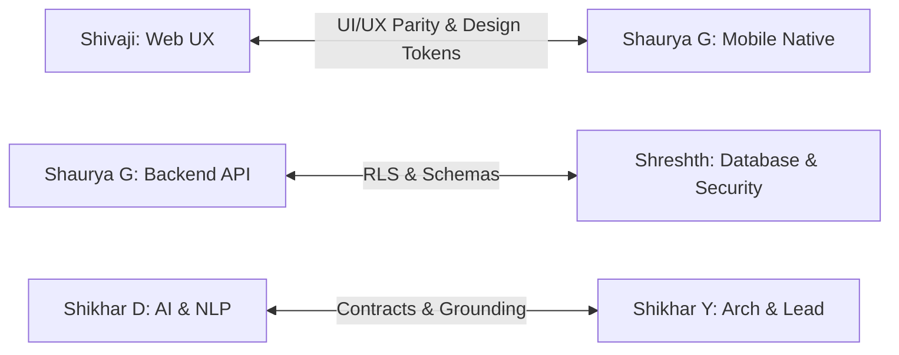

# Domain Ownership and Interface Handoffs: Medi Bud AI Health Companion

**Project:** Medi Bud AI Health Companion (College Prototype)  
**Date:** 2 October 2026  
**Institution:** Dr. A.P.J. Abdul Kalam Technical University / College Mini-Project Team  

This document formalizes individual domain ownership, deliverables, peer review pairings, and explicit interface contracts for the six team members. Agent-generated code and test suites serve as an implementation foundation to support and demonstrate these deliverables.

---

## 1. Domain Ownership Matrix

| Member | Primary Domain | Core Deliverables | Verification Responsibility |
| :--- | :--- | :--- | :--- |
| **Shikhar Yadav** *(Roll: 2401640100930)* | **Team Lead, Architecture & Integration** | Monorepo structure, shared contracts (`packages/contracts`), API client generation, end-to-end integration orchestration, release checklist, viva presentation narrative. | Rehearsal checklist, multi-client integration, documentation coherence, viva demonstration flow. |
| **Shivaji Rajawat** *(Roll: 2401640100933)* | **Web Frontend & UX** | Next.js 15 App Router (`apps/web`), responsive layout, Medi Bud rebranding, habit dashboard, report correction interface, source-grounded chat view, Dexie.js offline outbox. | Cross-browser compatibility, responsive viewports (320px to 4K), web accessibility (a11y), client token refresh. |
| **Shaurya Gautam** *(Roll: 2401640100918)* | **Mobile & Native Features** | Expo / React Native (`apps/mobile`), Expo Router, camera/document pickers, native PDF sharing, local notification scheduling, expo-sqlite offline habit outbox. | Android build / Expo development build, permission denial handling, offline replay on network reconnect. |
| **Shaurya Gupta** *(Roll: 2401640100920)* | **Backend & API** | FastAPI modular monolith (`services/api`), Supabase JWT signature/claims verification, asynchronous PostgreSQL worker daemon, sync idempotency engine, Overpass OSM care proxy, ReportLab PDF service. | OpenAPI spec conformance, unit tests, idempotency collision tests, worker restart lease recovery. |
| **Shreshth Gupta** *(Roll: 2401640100967)* | **Database, Security & Deployment** | Supabase migrations (`supabase/migrations`), PostgreSQL schema, Row-Level Security (RLS) policies on all tables, `pgvector(384)` index, storage bucket access controls, Docker/Compose infra. | Two-user isolation tests, RLS leak verification, migration rollback scripts, zero secret leakage checks. |
| **Shikhar Dubey** *(Roll: 2401640100928)* | **AI, NLP & Evaluation** | Text extraction & OCR (pypdf/Tesseract), normalizer for CBC/Glucose/Lipids, `all-MiniLM-L6-v2` dense embedding generation, hybrid RRF retrieval, scikit-learn intent classifier (6 labels), safety triage rules. | Macro-F1 >= 0.80 benchmark, Recall@5 evaluation, citation validity check, red-flag safety questionnaire tests. |

---

## 2. Peer Review and Interface Handoffs

### Handoff Protocol
1. **Frontend ↔ Backend:**  
   Shaurya Gupta (Backend) publishes the OpenAPI schema `/v1/openapi.json`. Shikhar Yadav generates the typed client in `packages/api-client`. Shivaji Rajawat (Web) and Shaurya Gautam (Mobile) consume this client; no hand-typed raw URLs or untyped fetch calls are permitted.
2. **Database ↔ Backend:**  
   Shreshth Gupta (Database) defines table schemas, constraints, and RLS policies in `supabase/migrations/`. Shaurya Gupta enforces that all routine queries pass user tokens so RLS applies, and the worker process verifies ownership before executing background updates.
3. **AI ↔ Frontend:**  
   Shikhar Dubey (AI/NLP) defines the observation review schema (with original test label, canonical test, numeric value, comparator, unit, reference interval, and review state). Both Web and Mobile present these exact fields for user confirmation before facts can be used in cited Q&A.
